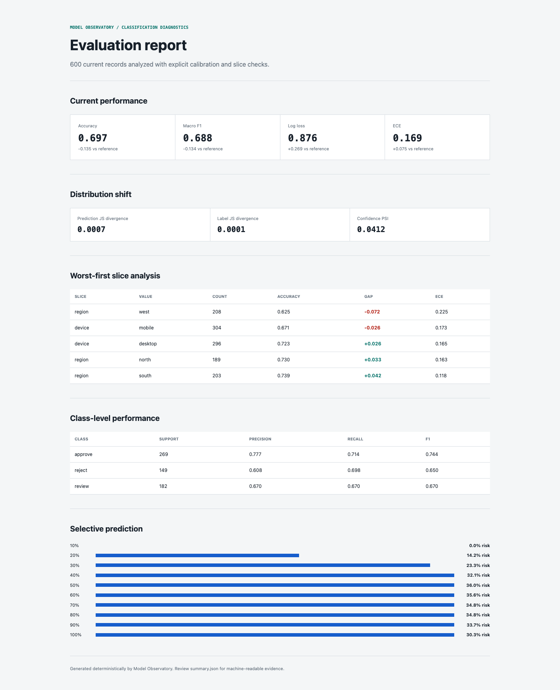
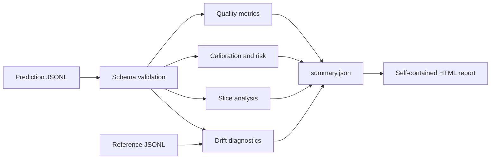

# Model Observatory

[](https://github.com/x5cgntw49w-cell/model-observatory/actions/workflows/ci.yml)
[](pyproject.toml)
[](LICENSE)

A dependency-light evaluation and monitoring toolkit for multiclass
classification systems. It turns prediction JSONL into a machine-readable
summary and a self-contained HTML report covering quality, calibration,
selective prediction, slice performance, and distribution shift.

**[Open the live demonstration report](https://x5cgntw49w-cell.github.io/model-observatory/)**



## Why this exists

An aggregate accuracy score can hide overconfidence, class-specific failure,
or a weak user segment. Model Observatory provides one reproducible command for
the checks that should happen before a classifier is promoted or after its
input distribution changes.

The project is intentionally dependency-light: the runtime uses only the Python
standard library, so the report can run in CI or a constrained batch job.

## System design



### Evaluation surface

| Area | Included diagnostics |
|---|---|
| Predictive quality | Accuracy, balanced accuracy, macro F1, per-class precision/recall/F1, confusion matrix |
| Probabilistic quality | Multiclass log loss, Brier score, expected calibration error |
| Selective prediction | Risk and minimum-confidence threshold across coverage levels |
| Slice analysis | Count, accuracy gap, macro F1, mean confidence, and ECE by scalar slice |
| Distribution shift | Prediction/label Jensen-Shannon divergence, confidence PSI, slice-prevalence drift |

## Quick start

```bash
python -m venv .venv
source .venv/bin/activate
python -m pip install -e ".[dev]"

model-observatory demo --output-dir demo-output --size 600 --seed 17
open demo-output/report.html
```

The demo creates deterministic synthetic reference and current datasets. The
current dataset intentionally contains a device and region shift so that the
report has a real diagnostic target. It is not presented as production data.

## Evaluate your own predictions

Each JSONL row contains a stable ID, the observed label, a normalized
probability map, and optional scalar slices:

```json
{"id":"request-0001","label":"approve","probabilities":{"approve":0.72,"reject":0.08,"review":0.20},"slices":{"device":"mobile","region":"north"}}
```

Evaluate one dataset:

```bash
model-observatory evaluate predictions.jsonl \
  --output-dir report \
  --min-slice-count 20
```

Compare a current dataset with a reference:

```bash
model-observatory compare \
  --reference reference.jsonl \
  --current current.jsonl \
  --output-dir report
```

Outputs:

- `report.html`: self-contained reviewer-facing report
- `index.html`: equivalent report entry point for static hosting
- `summary.json`: complete machine-readable metrics and diagnostics

## Validation guarantees

The loader rejects malformed JSON, duplicate IDs, inconsistent class spaces,
unknown labels, non-finite probabilities, values outside `[0, 1]`, and rows
whose probabilities do not sum to one. Errors include file and line context.

## Reproducibility

```bash
python -m pytest
python -m model_observatory demo --output-dir /tmp/model-observatory-demo --size 600 --seed 17
```

CI runs the test suite on Python 3.10, 3.11, and 3.12 and regenerates the demo
artifact from a fixed seed.

## Interpretation boundaries

- PSI and Jensen-Shannon divergence indicate change; they do not explain cause.
- Thresholds are intentionally not hard-coded because acceptable drift depends
  on domain risk, sample size, and operational policy.
- Slice results are descriptive and require enough support plus domain review.
- Calibration on historical labels does not guarantee future reliability.

## Project structure

```text
model_observatory/
  cli.py       command-line interface
  schema.py    validated prediction contract
  metrics.py   quality, calibration, and risk
  slices.py    worst-first subgroup analysis
  drift.py     distribution comparisons
  report.py    deterministic HTML/JSON output
tests/         hand-calculated and end-to-end tests
docs/          generated demonstration artifact
```

## License

[MIT](LICENSE)
